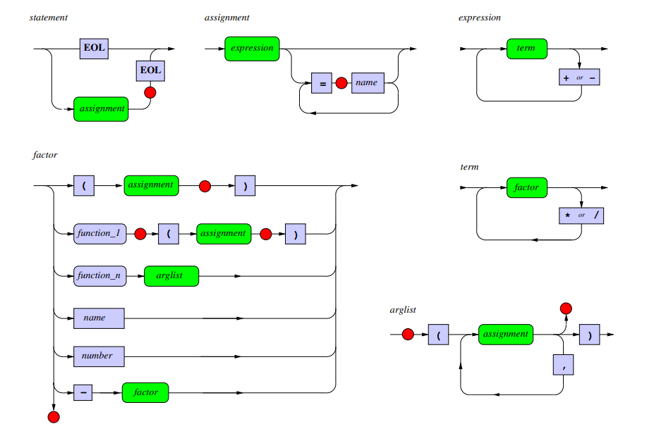

# Calculator

This project was developed as part of a school assignment. The main objective was to practice parsing with recursive descent and utilizing function objects. The test file (`MA2_test.py`) was provided by the school to verify the functionality of the calculator.

## Features

- **Recursive Descent Parsing**: Implements a calculator using recursive descent parsing techniques.
- **Function Objects**: Supports mathematical functions like `sin`, `cos`, `log`, `exp`, etc.
- **Error Handling**: Provides detailed error handling for syntax errors and evaluation errors.
- **Unique Variable Assignment**: Unlike traditional programming, variables are assigned values from left to right. For example, `9 + 3 = y` is valid, whereas `y = 3 + 9` is not.
- **Predefined and User-Defined Variables**: The calculator includes predefined variables such as `PI` and `E`, and also allows users to define their own variables.

## Flowchart

The flow chart for the functions:



## Usage

- The calculator can evaluate basic arithmetic expressions as well as more complex functions like  Fibonacci (`fib`) and Factorial (`fac`).

- **Variable Assignment**: The calculator assigns variables using a left-to-right syntax. For example:
    ```bash
    Input: 9 + 3 = y
    Output: y = 12
    ```
  However, an expression like `y = 3 + 9` would result in a syntax error.
  
- **Viewing Variables**: 
  - You can view all the variables, including predefined ones like `PI` and `E`, as well as any variables you've defined yourself using the `vars` command.
  - Example:
    ```bash
    Input: vars
    Output:
    E : 2.718281828459045
    PI : 3.141592653589793
    ans : 1.9092974268256817
    x : 1.0
    y : 2.0
    ```

- **Example usage**:
    ```bash
    Input: sin(PI) + 1
    Output: 1.0
    ```

## Testing

The provided test file (`MA2_test.py`) can be used to verify the functionality of the calculator:

```bash
python MA2_test.py